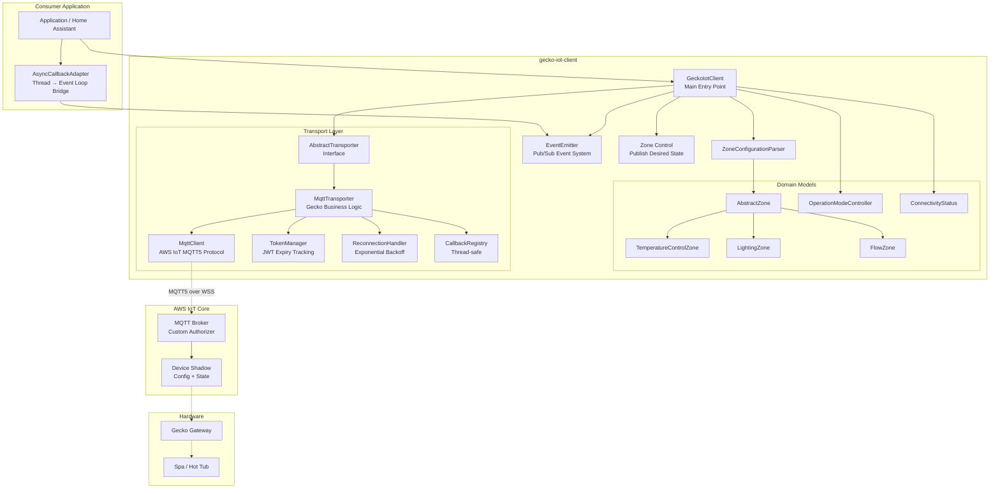
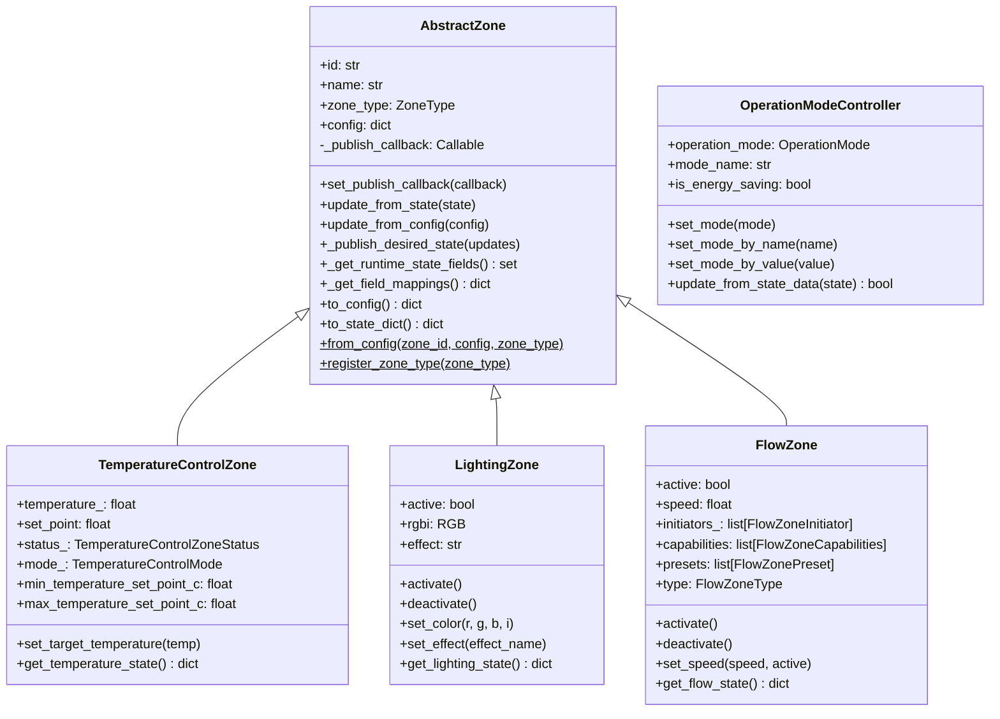
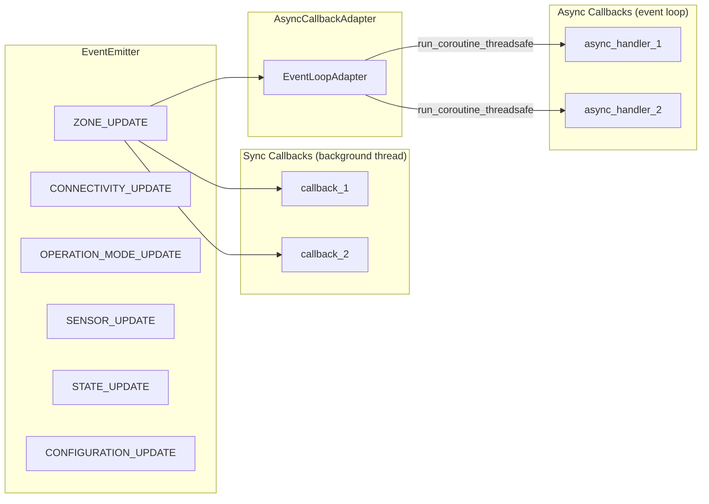
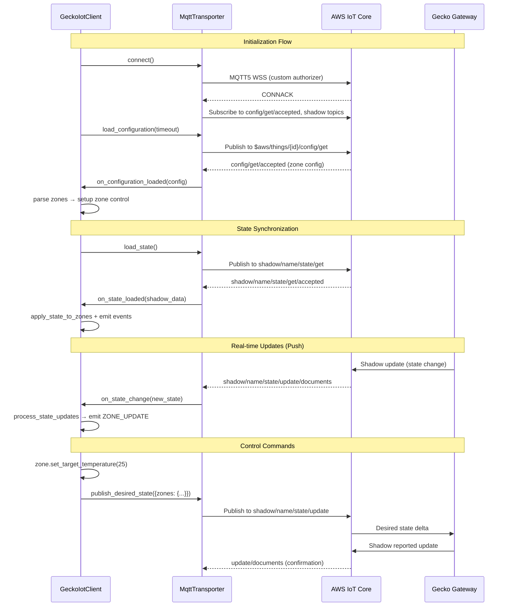
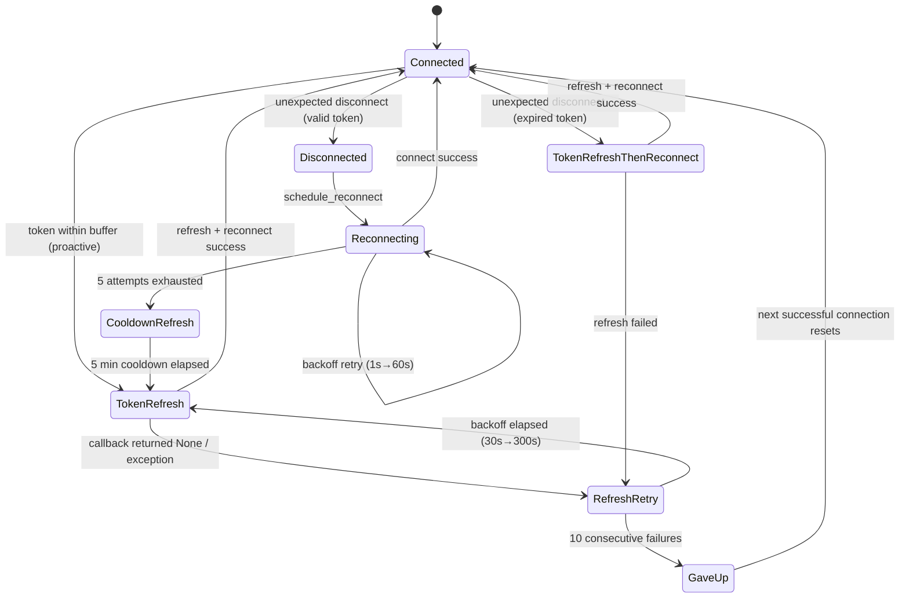
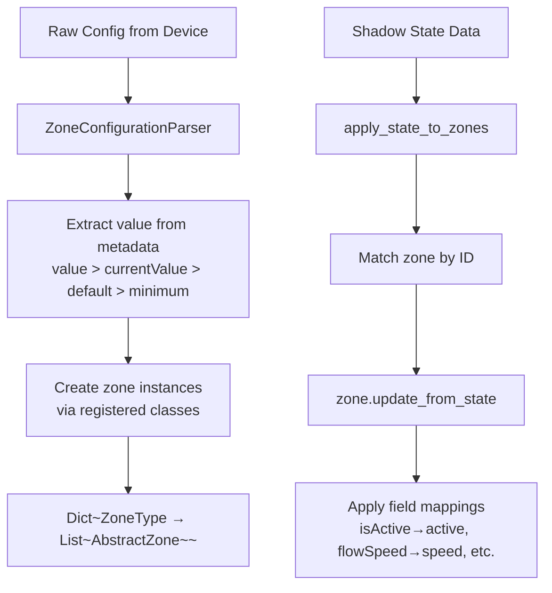
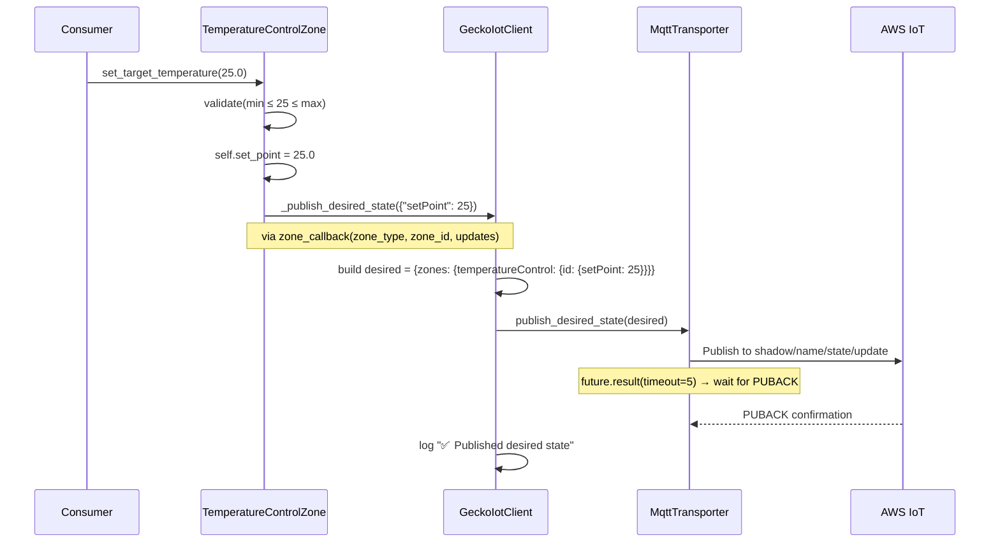

# gecko-iot-client — Architecture & Evaluation

## Overview

`gecko-iot-client` is a standalone Python library published to PyPI that provides communication with Gecko IoT devices (spas, hot tubs, pool equipment) via AWS IoT Core over MQTT/WebSocket. It offers an event-driven, zone-based API for real-time device control and state synchronization.



---

## Key Concepts

### 1. GeckoIotClient — The Facade

`GeckoIotClient` is the single entry point for consumers. It orchestrates:

- Connection lifecycle (connect/disconnect via transporter)
- Configuration loading and zone parsing
- State change processing and distribution
- Event registration (sync and async callbacks)
- Zone control setup (binding publish callbacks to zones)
- Diagnostics API

```python
# Minimal usage
with GeckoIotClient("monitor-id", transporter) as client:
    client.on(EventChannel.ZONE_UPDATE, my_handler)
    zones = client.get_zones()
```

### 2. Zone-Based Domain Model

All controllable features are modeled as **zones** — a polymorphic hierarchy with a decorator-based registry.



**Zone Types:**

| Zone Type | Enum Value | Capabilities |
|-----------|-----------|--------------|
| TemperatureControlZone | `temperatureControl` | Current temp, target temp, heating status, eco mode, min/max limits |
| LightingZone | `lighting` | On/off, RGB+intensity color, named effects |
| FlowZone | `flow` | On/off, variable speed, presets, initiator tracking, sub-types (pump/waterfall/blower) |

**Registry Pattern:**

```python
@AbstractZone.register_zone_type(ZoneType.FLOW_ZONE)
class FlowZone(AbstractZone): ...
```

This allows `ZoneConfigurationParser` to instantiate the correct class based on the `zone_type` key in device configuration without explicit if/else chains.

### 3. Event System



**EventChannel enum:**
- `CONNECTIVITY_UPDATE` — transport/gateway/vessel status changes
- `OPERATION_MODE_UPDATE` — watercare mode changes
- `ZONE_UPDATE` — zone configuration or runtime state changes
- `SENSOR_UPDATE`, `STATE_UPDATE`, `CONFIGURATION_UPDATE` — reserved for future use

**Dual callback support:**
- `client.on(channel, sync_callback)` — called directly on the emitting thread
- `client.on_async(channel, async_callback)` — dispatched to consumer's event loop via adapter

### 4. Transport Layer Architecture

```mermaid
graph TB
    subgraph "AbstractTransporter Interface"
        CONNECT[connect/disconnect]
        PUB[publish_desired_state]
        LOAD[load_configuration / load_state]
        CB[on_state_change / on_connectivity_change / on_configuration_loaded / on_state_loaded]
    end

    subgraph "MqttTransporter (Gecko Business Logic)"
        TOPICS[Topic Builder: $aws/things/{monitor_id}/...]
        CONFIG_FLOW[Config Request/Response]
        STATE_FLOW[Shadow Get/Update/Documents]
        TOKEN[Token Refresh + Reconnection]
    end

    subgraph "MqttClient (Protocol Layer)"
        MQTT5[AWS CRT MQTT5 Client]
        PARSE[WebSocket URL Parser]
        ROUTE[Message Router → Topic Handlers]
        LIFECYCLE[Connection Lifecycle Callbacks]
    end

    CONNECT --> TOPICS
    PUB --> STATE_FLOW
    LOAD --> CONFIG_FLOW
    CB --> TOKEN

    TOPICS --> MQTT5
    CONFIG_FLOW --> MQTT5
    STATE_FLOW --> MQTT5
    TOKEN --> MQTT5
    MQTT5 --> PARSE
    MQTT5 --> ROUTE
    MQTT5 --> LIFECYCLE
```

The transport is split into two layers:

| Layer | Class | Responsibility |
|-------|-------|---------------|
| Business Logic | `MqttTransporter` | Gecko topic structure, shadow operations, token management, retry orchestration |
| Protocol | `MqttClient` | MQTT5 connect/publish/subscribe, URL parsing, message routing, lifecycle events |

### 5. AWS IoT Shadow Integration

The library communicates with Gecko devices via AWS IoT Device Shadows:



**Topic Structure:**

| Topic | Direction | Purpose |
|-------|-----------|---------|
| `$aws/things/{id}/config/get` | Publish | Request device configuration |
| `$aws/things/{id}/config/get/accepted` | Subscribe | Configuration response |
| `$aws/things/{id}/shadow/name/state/get` | Publish | Request current state |
| `$aws/things/{id}/shadow/name/state/get/accepted` | Subscribe | State response |
| `$aws/things/{id}/shadow/name/state/update` | Publish | Set desired state |
| `$aws/things/{id}/shadow/name/state/update/documents` | Subscribe | Real-time state changes |

### 6. Token Management & Reconnection



**Token Lifecycle:**
1. `TokenManager` parses JWT from broker URL at construction
2. Background thread checks expiry every 10 seconds
3. When `time_to_expiry <= refresh_buffer_seconds`: triggers refresh
4. Refresh path: invoke callback → get new URL → disconnect → reconnect with fresh URL
5. On failure: progressive backoff (30s × 2^(n-1), max 300s)
6. After 10 consecutive failures: stops retrying until next manual reconnect

**Reconnection Strategy:**
- `ReconnectionHandler`: exponential backoff (1s → 2s → 4s → ... → 60s max)
- Max 5 attempts before entering cooldown
- Cooldown: waits 5 minutes then forces a token refresh
- Connectivity callbacks are **suppressed** during refresh/reconnect to prevent UI flicker

### 7. AsyncCallbackAdapter (Thread Bridge)

```mermaid
sequenceDiagram
    participant BG as Background Thread<br/>(MQTT callbacks)
    participant EE as EventEmitter
    participant ACA as AsyncCallbackAdapter
    participant LOOP as Consumer Event Loop
    participant HANDLER as Async Handler

    BG->>EE: emit(ZONE_UPDATE, data)
    Note over EE: Sync callbacks called directly on BG thread
    EE->>ACA: schedule(async_handler(data))
    ACA->>LOOP: run_coroutine_threadsafe(coro)
    LOOP->>HANDLER: await async_handler(data)

    Note over BG,HANDLER: For token refresh (needs return value)
    BG->>ACA: schedule_with_result(coro, timeout=30)
    ACA->>LOOP: run_coroutine_threadsafe(coro)
    LOOP->>HANDLER: result = await coro
    HANDLER-->>ACA: return result
    ACA-->>BG: future.result() → unblocks thread
```

Two implementations:
- `AsyncCallbackAdapter` (ABC) — defines the interface
- `EventLoopAdapter` — concrete implementation using `asyncio.run_coroutine_threadsafe`

This abstraction allows the library to work with any event loop framework, not just asyncio.

### 8. Zone Configuration Parsing



Two distinct update paths:
1. **Configuration** (structure/limits) → `parse_zones_configuration()` → creates zone instances
2. **Runtime State** (current values) → `apply_state_to_zones()` → updates existing instances

Each zone defines `_get_field_mappings()` to translate device-side names to Python attributes:
```python
# FlowZone mappings
{"isActive": "active", "flowSpeed": "speed", "pumpSpeed": "speed", "running": "active"}
```

### 9. Zone Control (Desired State Publishing)

When a consumer calls a control method (e.g., `zone.set_target_temperature(25)`):



The publish path validates connectivity before sending and blocks for delivery confirmation (PUBACK).

---

## Features Summary

| Feature | Implementation |
|---------|---------------|
| AWS IoT MQTT5 | `awscrt` + `awsiot` via custom authorizer (WebSocket + JWT) |
| Multi-zone control | Polymorphic zone hierarchy with registry pattern |
| Real-time state sync | Device Shadow subscriptions → push updates via events |
| Async/sync callbacks | `EventEmitter` with `AsyncCallbackAdapter` bridge |
| Token management | Proactive refresh with progressive backoff |
| Reconnection | Exponential backoff (5 attempts → cooldown → forced refresh) |
| Connectivity tracking | `ConnectivityStatus` (transport + gateway + vessel) |
| Operation modes | `OperationModeController` (Away, Standard, Savings, etc.) |
| Diagnostics API | `get_diagnostics()` method for observability |
| Context manager | `with GeckoIotClient(...) as client:` lifecycle |
| Type safety | Full type hints, `py.typed` marker |
| Extensibility | `AbstractTransporter` interface for alternative protocols |

---

## Package Structure

```
gecko_iot_client/
├── src/gecko_iot_client/
│   ├── __init__.py              # GeckoIotClient facade + public API exports
│   ├── api.py                   # GeckoApiClient ABC (HTTP REST client)
│   ├── async_adapter.py         # AsyncCallbackAdapter + EventLoopAdapter
│   ├── const.py                 # Library constants
│   ├── models/
│   │   ├── __init__.py          # Model re-exports
│   │   ├── abstract_zone.py    # AbstractZone base + ZoneType enum + registry
│   │   ├── connectivity.py     # ConnectivityStatus (transport/gateway/vessel)
│   │   ├── events.py           # EventChannel + EventEmitter
│   │   ├── flow_zone.py        # FlowZone + presets + capabilities + initiators
│   │   ├── lighting_zone.py    # LightingZone + RGB
│   │   ├── operation_mode.py           # OperationMode enum + OperationModeStatus
│   │   ├── operation_mode_controller.py # Read/write controller for watercare
│   │   ├── temperature_control_zone.py # TemperatureControlZone + status enum
│   │   ├── zone_parser.py      # ZoneConfigurationParser
│   │   └── zone_types.py       # Convenience re-export of all zone types
│   └── transporters/
│       ├── __init__.py          # AbstractTransporter base class
│       ├── connection_state.py  # ConnectionStateManager (state machine)
│       ├── exceptions.py        # Exception hierarchy
│       └── mqtt/
│           ├── __init__.py      # MqttTransporter + MqttClient exports
│           ├── callback_registry.py  # Thread-safe callback storage
│           ├── client.py        # MqttClient (low-level MQTT5)
│           ├── constants.py     # Timeouts, backoff constants
│           ├── reconnection_handler.py # Exponential backoff logic
│           ├── token_manager.py # JWT parsing + expiry tracking
│           ├── transporter.py   # MqttTransporter (Gecko business logic)
│           └── utils.py         # JSON parsing, future helpers, callback dispatch
├── tests/                       # 17 test modules
├── examples/demo.py             # Interactive demo script
├── docs/                        # Sphinx documentation source
├── pyproject.toml               # Build config (setuptools + setuptools-scm)
└── pytest.ini                   # Test configuration (markers: unit, integration, slow)
```

---

## Senior Architect Evaluation

### Strengths

1. **Clean layered architecture** — The separation between `MqttClient` (protocol) and `MqttTransporter` (business logic) is excellent. Each has a focused responsibility and can be tested independently.

2. **Framework-agnostic design** — The `AsyncCallbackAdapter` abstraction means the library doesn't depend on any specific event loop framework. It works equally well with Home Assistant, a standalone asyncio script, or a different runtime.

3. **Thoughtful zone model** — The registry pattern with decorators provides clean extensibility. Adding a new zone type requires only a new class with `@register_zone_type`. The separation of config parsing vs. runtime state updates via `_get_field_mappings()` handles the impedance mismatch between device naming and Python conventions.

4. **Robust token lifecycle** — The proactive refresh (before expiry), progressive backoff on failure, and the escalation path (refresh → reconnect → cooldown → forced refresh) show production hardening.

5. **Good event semantics** — `EventChannel` provides clear categorization, and the emit/on/off API is simple. Supporting both sync and async callbacks with suppression during internal operations (refresh/reconnect) prevents state thrashing.

6. **Publish confirmation** — Waiting for PUBACK (`future.result(timeout=5)`) before logging success ensures the message actually reached the broker, not just the local send buffer.

7. **Diagnostics API** — The `get_diagnostics()` method provides a structured snapshot without exposing internals, making it safe for external consumers (like the HA integration's diagnostics dump).

8. **Good test coverage** — 17 test modules covering reconnection flows, token management, zone parsing, event system, and edge cases. Tests use proper mocking to isolate the MQTT layer.

### Areas for Improvement

#### 1. Threading Model Should Be Async-Native (High Priority)

The transport layer uses 4–5 daemon threads:
- Expiry monitor loop (`_expiry_monitor_loop`)
- Reconnection attempts (`_delayed_reconnect`)
- Token refresh retries (`_delayed_refresh_retry`)
- Token-refresh-then-reconnect (`_do_token_refresh_then_reconnect`)
- Post-connection setup (`_setup_after_connection`)

This creates:
- Multiple `threading.RLock` and `threading.Event` synchronization points
- Potential for orphaned daemon threads on ungraceful shutdown
- Race conditions between concurrent state mutations
- Difficulty writing deterministic, fast unit tests

**Recommendation:** Since `awscrt`'s MQTT5 client already manages its own I/O thread internally, the additional threading is unnecessary. Migrate to:

```python
# Instead of threading.Thread + time.sleep:
class MqttTransporter:
    async def _expiry_monitor_loop(self):
        while not self._stopped:
            if self._should_refresh_token():
                await self._handle_token_refresh()
            await asyncio.sleep(10)
```

This eliminates locks, simplifies testing (control the event loop), and reduces the concurrency surface area dramatically.

#### 2. `AbstractTransporter` Should Use ABC (Medium Priority)

Currently uses `raise NotImplementedError` — no compile-time or static analysis enforcement:

```python
# Current
class AbstractTransporter:
    def connect(self):
        raise NotImplementedError(...)

# Proposed
from abc import ABC, abstractmethod
class AbstractTransporter(ABC):
    @abstractmethod
    def connect(self): ...
```

This enables mypy to catch missing implementations at import time rather than at runtime.

#### 3. `_publish_callback` Is a Class Variable (Bug)

```python
class AbstractZone:
    _publish_callback: Optional[Callable[...]] = None  # class-level!
```

This is a mutable class attribute. Setting it on an instance creates a shadow — it "works" because `setup_zone_control()` always calls `set_publish_callback()` on every zone. But:
- If a zone is created without calling `set_publish_callback()`, it shares `None` with all zones
- If one zone's callback is set at the class level (rare bug path), all zones get it
- Static analysis tools flag this as suspicious

**Fix:** Move to `__init__`:
```python
def __init__(self, ...):
    self._publish_callback: Optional[Callable[...]] = None
```

#### 4. No Async API for Zone Control Methods (Medium Priority)

Zone control methods like `set_target_temperature()`, `activate()`, `set_speed()` are synchronous. They call `_publish_desired_state()` which calls the sync `zone_callback` which calls `transporter.publish_desired_state()` and blocks on `future.result(timeout=5)`.

In an asyncio context (like Home Assistant), this means consumers must wrap calls in `async_add_executor_job()`.

**Recommendation:** Add async variants:
```python
async def async_set_target_temperature(self, temperature: float) -> None:
    ...
    await asyncio.get_event_loop().run_in_executor(
        None, self._publish_desired_state, {"setPoint": temperature}
    )
```

Or better: make the publish path fully async when an `AsyncCallbackAdapter` is available.

#### 5. `ConnectionStateManager` Is Unused (Medium Priority)

`connection_state.py` defines a full-featured `ConnectionStateManager` with:
- State machine (DISCONNECTED → CONNECTING → CONNECTED → ...)
- Event history
- Callbacks
- Its own reconnection loop

But `MqttTransporter` uses its own `_is_reconnecting` / `_is_refreshing_token` flags and `ReconnectionHandler` instead. The `ConnectionStateManager` appears to be dead code or a leftover from an earlier design iteration.

**Recommendation:** Either:
- Remove `ConnectionStateManager` and document the actual state machine in `MqttTransporter`
- Or refactor `MqttTransporter` to delegate state management to `ConnectionStateManager`, eliminating the ad-hoc flags

#### 6. Duplicate State Processing Logic (Medium Priority)

`OperationModeStatus` and `OperationModeController` both have:
- `update_from_state_data(state_data) -> bool`
- `mode_name` property
- `is_energy_saving` property
- `to_dict()` method

`OperationModeStatus` is a read-only data class. `OperationModeController` adds write capabilities. But the duplication is confusing — consumers don't know which to use.

**Recommendation:** Remove `OperationModeStatus` and use `OperationModeController` everywhere. If a read-only view is needed, expose it as a `@property` on the controller that returns a frozen dataclass.

#### 7. No Dependency Injection for MqttClient (Low Priority)

`MqttTransporter.__init__` directly instantiates `MqttClient`, `TokenManager`, and `ReconnectionHandler`:

```python
self._token_manager = TokenManager(broker_url, ...)
self._reconnection_handler = ReconnectionHandler()
self._mqtt_client = MqttClient(...)
```

This makes unit testing require patching at the class level (`patch("...MqttClient")`).

**Recommendation:** Accept these as optional constructor parameters with default factories:
```python
def __init__(self, ..., mqtt_client: MqttClient | None = None, ...):
    self._mqtt_client = mqtt_client or MqttClient(...)
```

#### 8. Zone `config` Attribute Stores Raw Config Indefinitely (Low Priority)

Every zone stores the entire raw config dict as `self.config`. This is used by `FlowZone` to re-derive `speed_config` and `type` on every property access. However:
- It's mutable (consumers could accidentally modify it)
- It wastes memory for large configurations
- The raw config semantics leak into the domain model

**Recommendation:** Extract what's needed at `__init__` time and discard (or freeze) the raw config:
```python
def __init__(self, zone_id, config):
    self._speed_config = config.get("speed") if isinstance(config.get("speed"), dict) else None
    # Don't store raw config long-term
```

#### 9. GeckoApiClient ABC Lives in the IoT Client Library (Low Priority)

`api.py` defines `GeckoApiClient` — an abstract HTTP client for the Gecko REST API. This is used by the HA integration to fetch user info, vessels, and livestream URLs. However:
- It uses `aiohttp` (an optional dependency not declared in the main dependencies)
- It mixes concerns: the IoT client is about MQTT communication, not REST API

**Recommendation:** Either:
- Move `GeckoApiClient` to its own package/module clearly marked as optional
- Or declare `aiohttp` as a required dependency (it already is in `pyproject.toml`)
- Document that this class is intended for consumers who need both MQTT and REST access

#### 10. No Structured Logging (Low Priority)

The library uses Python's stdlib `logging` with f-string messages. This works but doesn't support structured logging (JSON output, correlation IDs, etc.) that cloud-native consumers may want.

**Recommendation:** Consider using `structlog` or at minimum, pass key fields as `extra={}` in log calls:
```python
logger.info("Token refreshed", extra={"monitor_id": self._monitor_id, "expiry": str(new_expiry)})
```

This makes logs queryable in centralized logging systems.

---

## Testing Architecture

```
tests/
├── test_api.py                    # GeckoApiClient HTTP methods
├── test_async_adapter.py          # EventLoopAdapter thread bridging
├── test_callback_registry.py      # Thread-safe callback storage
├── test_connectivity.py           # ConnectivityStatus state transitions
├── test_diagnostics_api.py        # get_diagnostics() output structure
├── test_events.py                 # EventEmitter pub/sub behavior
├── test_exceptions.py             # Exception hierarchy
├── test_mqtt_utils.py             # JSON parsing, future helpers
├── test_operation_mode.py         # OperationMode enum conversion
├── test_operation_mode_controller.py  # Mode controller state + commands
├── test_publish_confirmation.py   # PUBACK waiting behavior
├── test_reconnection_flows.py     # Full reconnection orchestration
├── test_reconnection_handler.py   # Exponential backoff math
├── test_token_manager.py          # JWT parsing + expiry tracking
├── test_zone_parser.py            # Config → zone instances
└── test_zone_states.py            # Runtime state application
```

**Test patterns used:**
- `unittest.mock.patch` for isolating MQTT client from network
- Helper functions to generate valid broker URLs with configurable expiry
- Thread timing assertions with `time.sleep` for concurrency tests
- Direct method invocation to test internal flows without threading

---

## Summary

`gecko-iot-client` is a well-architected IoT client library with clean separation of concerns, a thoughtful domain model, and production-grade resilience features. The layered transport design and framework-agnostic async adapter make it suitable for diverse consumers.

The highest-impact improvements are:
1. **Migrate threading to asyncio** — eliminates the largest source of complexity and potential bugs
2. **Remove dead code** (`ConnectionStateManager`, duplicate `OperationModeStatus`) — reduces confusion
3. **Fix the class-variable bug** on `_publish_callback` — prevents subtle future issues
4. **Add async control methods** — eliminates the need for consumers to manually bridge threads for every zone command

These changes would evolve the library from "works well with careful usage" to "hard to misuse" — the gold standard for a public API.
